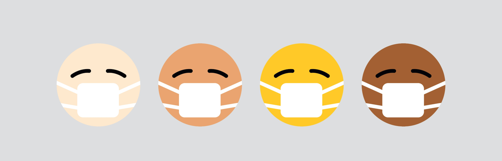
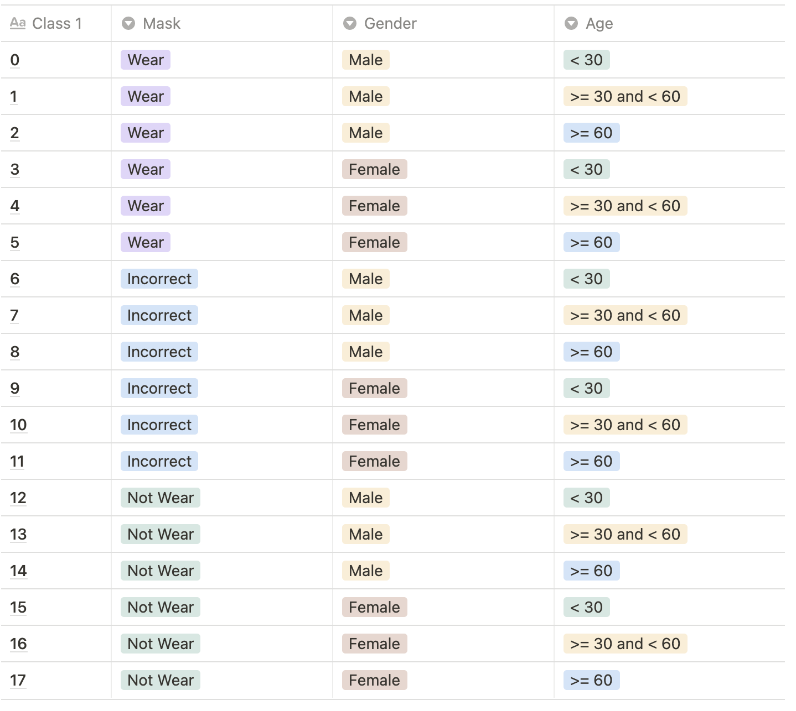

    <h1>Mask Wear Image Classification</h1>
    
    <small><strong>Photo by <a href="https://unsplash.com/@visuals?utm_source=unsplash&utm_medium=referral&utm_content=creditCopyText">visuals</a> on <a href="https://unsplash.com/s/photos/covid-mask?utm_source=unsplash&utm_medium=referral&utm_content=creditCopyText">Unsplash</a></strong></small>

---

## 📝 Table of Contents

- [대회 개요](#-대회-개요)
- [대회 결과](#-대회-결과)
- [EDA](#-eda)
- [접근 방법](#-접근-방법)
- [시도했으나 잘 안된 것](#-시도했으나-잘-안된-것)
- [회고](#-회고)

---

## 📌 대회 개요

### 배경

- COVID-19는 감염자의 입, 호흡기로부터 나오는 비말, 침 등으로 쉽게 전파된다.
- COVID-19의 감염 확산을 막기 위해서는 모든 사람이 마스크를 올바르게 착용하여 전파 경로를 원천 차단해야 한다.
- 올바르게 착용한다는 것은 코와 입을 완전히 가리는 것을 말한다.
- 넓은 공공장소에서 모든 사람들의 올바른 마스크 착용 상태를 검사하기 위해서는 추가적인 인적자원이 필요하다.

### 문제 정의

카메라로 비춰진 사람 얼굴 이미지 만으로 이 사람이 마스크를 쓰고 있는지, 쓰지 않았는지, 정확히 쓴 것이 맞는지를 분류하는 모델

- <i><b>input</b></i>:  크기의 마스크를 쓴 사람의 얼굴 이미지 <strong>(384, 512)</strong>
- <i><b>output</b></i>: 18개의 클래스 <strong>(마스크 착용여부, 성별, 나이)</strong>로 나타낼 수 있는 조합

클래스 명세 살펴보기

    
     

### 평가 지표: <i>Macro F1 Score</i>

<!-- $F_1 = 2 * \frac{precision*recall}{precision+recall}$ --> 

<!-- $precision = \frac{TP}{TP+FP}, \qquad recall = \frac{TP}{TP+FN}$ --> 

---

## 🏆 대회 결과

- `Public LB` : **등수** 40등 | **정확도** 80.4762% | **F1-Score** 0.7625
- `Private LB` : **등수** 38등 | **정확도** 80.5238% | **F1-Score** 0.7506

---

## 🔎 EDA

### train과 eval 데이터

- train은 총 2700개의 데이터와 5개의 피처로 이루어져 있다. 각 데이터마다 마스크 쓴 이미지 5개, 마스크를 이상하게 쓴 이미지 1개, 마스크를 안 쓴 이미지 1개 총 7개의 이미지를 가진다.
- eval은 12600개의 데이터와 2개의 피처로 이루어져 있으며, 피처 2개는 이미지 id와 클래스 라벨이다. 그러므로 성별/나이/마스크 착용여부 3가지를 예측해야한다는 계획은 옳은 것으로 판단된다.

### train 피처의 고유값

`train.csv`는 id, gender, race, age, path로 총 5개의 피처로 이루어져 있다. 각 피처는 다음과 같은 값(value)를 가지고 있다.

- gender는 male과 female로 구성되어 있다.
- race는 오직 Asian 하나의 value로만 구성되어 있다. → 학습 시 큰 의미가 없으므로 제거하자.
- age는 정수이고 18부터 60까지의 정수값으로 구성되어 있다.

### train 피처의 분포

- 여성이 남성보다 약 1.5배 정도 많으며, 20대 초반과 50대 중후반의 사람이 많다.
- 타겟값으로 30대 미만, 30대 이상 60대 미만, 60대 이상으로 나누어 `age_bin`이라는 새로운 피처를 생성했으며, 각각은 0, 1, 2와 대응된다. 60대 이상의 경우 60살 밖에 없으므로 다른 값에 비해 데이터의 개수가 현저히 낮다.
- 여성/남성에 따라 나이의 분포가 달라지지 않았으나 `age_bin=1`에 대응하는 그룹이 거의 2배 가까이 여성이 더 많았다.
- 성별, 나이대, 마스크 착용여부를 가지고 각 클래스 라벨 별 개수를 세어보았다. 마스크를 쓴 이미지의 개수가 많으니 마스크를 쓴 라벨을 가진 데이터의 개수가 많았으며 나머지는 앞서 본 분포를 따랐다.

---

## 🚀 접근 방법

### Validation Method

- 데이터의 분포가 매우 불균형하므로 데이터의 분포에 맞춘 검증 데이터가 필요함을 느꼈다. 그래서 [Scikit-learn의 StratifiedKFold](https://scikit-learn.org/stable/modules/generated/sklearn.model_selection.StratifiedKFold.html)를 사용해 교차 검증하는 코드를 구현하였다.

### Best Single Model

> **정확도** 79.7778%, **F1 Score** 0.7575

|       key        |           value            |
| :--------------: | :------------------------: |
|     `model`      |      EfficientNet-b4       |
|   `criterion`    |      CrossEntropyLoss      |
|   `optimizer`    |          MadGrad           |
|   `batch size`   |             16             |
| `learning rate`  |            1e-6            |
| `epoch per fold` |             4              |
|      `seed`      |            525             |
|  `augmentation`  | CenterCrop(380), Normalize |

- *ResNet101*과 *EfficientNet*을 비교 실험한 결과 *EfficientNet*이 F1 Score와 정확도 모두에서 더 좋은 성능을 보여서 사용했다. 학습 시간과 이미지 사이즈를 고려했을 때, 시간 대비 성능이 잘 나오는 _Efficientnet-b4_ 모델을 선택했다.
- optimizer로 기존 *Adam*처럼 빠르게 수렴하면서 *SGD*와 같은 성능이 나는 *MadGrad*를 선택했다. 학습 시간은 비슷하되 *Adam*보다는 조금 더 나은 성능을 보여줬다.
- seed로 42, 2021, 525를 설정했는데, seed에 따라 F1 Score 값이 소수점 둘째 자리에서 왔다갔다 했다. 아무래도 데이터가 매우 불균형하고 특히 연속적인 값인 나이 피처를 억지로 카테고리 피처로 나눴기 때문에 조그마한 변화에도 모델 성능에 영향을 미치는 것으로 보였다.

### Resume Training with SGD

- [The Marginal Value of Adaptive Gradient Methods in Machine Learning](https://arxiv.org/pdf/1705.08292.pdf)에 따르면, *MadGrad*가 *SGD*와 *Adam*의 장점을 섞은 방법이지만, Adaptive Method이기 때문에 *SGD*보다는 성능이 떨어질 수 밖에 없다.
- 그래서 성능이 잘 나온 모델의 checkpoint를 불러오고 optimizer를 SGD로 변경하여 1 ~ 3 epoch 정도 학습을 더 진행했다. 그 결과 F1 Score가 0.76으로,정확도도 80%로 상승했고, 2 epoch일 때 가장 좋은 성능(정확도 80.5556%, F1 Score 0.7624)을 보였다.

### Ensemble

- 마지막으로 기존에 저장된 checkpoint를 사용하여 inference하여 나온 logit 값으로 soft voting을 진행했다.
- 처음에 다른 계열 모델인 *ResNet*과 *EfficientNet*을 앙상블하였지만, _ResNet_ 성능(정확도 50%)이 좋지 않아서 그런지 best single model보다 성능이 떨어졌다.
- 리더보드 기준 잘 나온 상위 4개 모델의 예측값을(*SGD*로 재학습시킨 모델, 시드가 다른 best 모델)을 앙상블하여 정확도 80.4762%, F1 Score 0.7625의 최고 성능을 얻었다.

---

## 😢 시도했으나 잘 안된 것

- _Rotate, RandomHorizontalFlip, ColorJitter_ 등 여러 `augmentation` 기법을 적용하면 학습 성능이 오히려 떨어지는 경향이 보였다. 아무래도 사람의 얼굴이 거의 대부분 이미지 정가운데에 위치해 있기 때문인 듯 하다.
- `criterion`으로 _Label Smoothing_ 기법을 사용했지만, *CrossEntropyLoss*에 비해 성능이 떨어졌다. 추측한 바로는 *Label Smoothing*이 모델이 예측한 클래스의 confidence가 100%가 되지 않도록 하는데 나이 피처 때문에 클래스 간 경계가 뚜렷하지 않아 성능이 떨어진 것 같다.

---

## 👀 회고

- **대회 초기의 다양한 실험**: 피어세션과 강의를 통해 사용할 수 있는 기법(method)를 모은 뒤 작은 모델로 여러 기법의 성능을 평가하면서 어떤 툴을 쓰면 좋을지 선택하는 식으로 실험했다. 후에 베이스코드를 가지고 모델 학습을 할 때 바로 툴을 결정할 수 있었고 하이퍼파라미터 튜닝 정도만 했다.
- **Scikit-learn 활용**: Pytorch는 모델 학습을 위한 라이브러리이기 때문에 f1-score, accuracy 계산 등과 같은 메서드가 구현이 되어있지 않았다. 이 때 Scikit-learn을 사용하면 금방 구현할 수 있었다. 이 때 주의해야할 점은 Scikit-learn은 대부분 입력값을 `numpy.array`로 받기 때문에 이를 변경해주는 작업을 해야한다!
- **대회는 경쟁이 아니라 협력이다**: 이번 대회에서 가장 큰 도움을 준 사람들은 역시 캠퍼분들이었다. 피어세션과 토의를 통해 어떤 모델을 쓰면 좋은지, 어떤 손실함수를 쓰면 좋은지, 어떤 epoch가 좋은지 등 정보를 많이 얻을 수 있었다. 그 덕분에 초반 모델 성능보다 훨씬 더 좋은 성능의 모델을 얻을 수 있었고 저 또한 얻은 정보를 다른 캠퍼분들에게 공유를 했다.
- **디버깅 툴과 AutoML을 꼭 사용해보자**: 실험 결과 기록을 Notion에 수기로 하다 보니 실험 결과가 직관적으로 와닿지 않았다. 다음에는 wandb나 tensorboard와 같은 시각화 툴을 사용해보려 한다. 또한 하이퍼파라미터 튜닝도 체계적이지 않아서 다음에는 AutoML을 사용해볼 예정이다.
